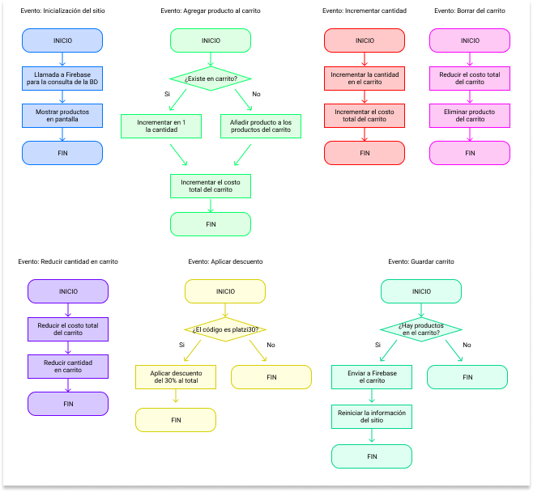

# Generador de facturas

## ¿Qué es?

El generador de facturas es uno de los proyectos realizados como parte de las actividades de Platzi Master. El objetivo del proyecto es generar una factura a partir de una lista de productos pre-definidos para un supermercado.

## ¿Cómo funciona?

El proyecto está dividido en dos partes principales:

### Firebase

Mediante el uso de Firebase, se crea una base de datos del tipo "Realtime Database", donde se almacenan los datos de los productos y las facturas.

### Frontend

Toda la parte que se almacena en este repositorio, y que constituye la parte visual del proyecto. Creado en Vanilla Javascript y LESS.

## Uso

El sitio se encuentra desplegado en Firebase Hosting, y se puede acceder a través de la URL: [https://facturas-master-cecg.web.app/](https://facturas-master-cecg.web.app/).

## Instalación

Si se desea instalar el sitio en un servidor, o se desea probar en un dispositivo local, se puede hacer de la siguiente manera:

    git clone https://github.com/ChristianECG/generador-de-facturas.git
    cd generador-de-facturas
    lessc styles.less public/styles.css

Y abrir el sitio (en la carpeta public) con el navegador de su preferencia.

## Licencia

El proyecto se encuentra bajo licencia MIT. Para consultar los términos propios de la licencia, puede consultar la [página de licencia de MIT](https://opensource.org/licenses/MIT).

## Diagrama de flujo

Con el fin de explicar de una forma clara el flujo de la información, se ha creado una serie de diagramas de flujo para los diferentes eventos que suceden en el sitio, y se encuentran disponibles a continuación:

